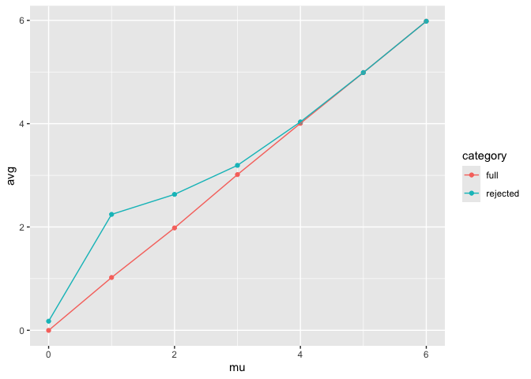

p8105_hw5_yy3563
================
Yifei Yu
2024-11-04

Load some packages.

``` r
library(tidyverse)
```

    ## ── Attaching core tidyverse packages ──────────────────────── tidyverse 2.0.0 ──
    ## ✔ dplyr     1.1.4     ✔ readr     2.1.5
    ## ✔ forcats   1.0.0     ✔ stringr   1.5.1
    ## ✔ ggplot2   3.5.1     ✔ tibble    3.2.1
    ## ✔ lubridate 1.9.3     ✔ tidyr     1.3.1
    ## ✔ purrr     1.0.2     
    ## ── Conflicts ────────────────────────────────────────── tidyverse_conflicts() ──
    ## ✖ dplyr::filter() masks stats::filter()
    ## ✖ dplyr::lag()    masks stats::lag()
    ## ℹ Use the conflicted package (<http://conflicted.r-lib.org/>) to force all conflicts to become errors

``` r
library(ggplot2)
library(dplyr)
```

## Problem 1

``` r
bday_sim = function(n) {
  
  bdays = sample(1:365, size = n, replace = TRUE)
  
  duplicate = length(unique(bdays)) < n
  
  return(duplicate)
}
```

``` r
sim_res =
  expand_grid(
    n = 2:50,
    iter = 1:10000
  ) |> 
  mutate(res = map_lgl(n, bday_sim)) |> 
  group_by(n) |> 
  summarize(prob = mean(res))

sim_res |> 
  ggplot(aes(x = n, y = prob)) +
  geom_line()
```

<!-- -->

The probability of a shared birthday rises quickly as the group size
increases. As the group size approaches 50, the probability becomes
close to 1, meaning that it becomes almost certain for larger groups to
have at least one shared birthday.

## Problem 2

``` r
library(broom)

n = 30
sigma = 5

sim_power = function(mu){
  
  tibble(
    x = rnorm(n, mu, sigma)) |> 
      summarize(
        tidy(t.test(x, mu = 0, conf.level=0.95))) |> 
    select(estimate, p.value)
  
}

sim_result = expand_grid(
  mu = 0:6,
  iter = 1:5000) |> 
  mutate(samp_res = map(mu, sim_power)) |> 
  unnest(samp_res)
```

``` r
sim_result |> 
  group_by(mu) |> 
  summarize(
    power = mean(p.value < 0.05)
  ) |> 
  ggplot(aes(x = mu, y = power)) +
  geom_point() +
  geom_line()
```

<!-- -->

As the effect size (the value of mu) increases, the power of the test
also increases. In other words, the probability of rejecting the null
hypothesis increases with larger deviations of mu from zero.

``` r
df1 = sim_result |> 
  group_by(mu) |> 
  summarize(avg = mean(estimate))  |> 
  mutate(category = "full")
```

``` r
df2 = sim_result |> 
  filter(p.value < 0.05) |> 
  group_by(mu) |> 
  summarize(avg = mean(estimate)) |> 
  mutate(category="rejected")

df <- rbind(df1, df2)

ggplot(df, aes(x = mu, y = avg, color = category)) + 
  geom_point() +
  geom_line()
```

<!-- -->
